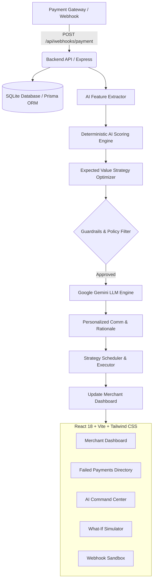

# 🚀 RecoverAI — Autonomous AI Revenue Recovery Agent for Failed Payments

> **"RecoverAI transforms failed online payment attempts into recoverable revenue using deterministic ML scoring, expected value strategy optimization, and personalized LLM communication."**

---

## 📋 Table of Contents
- [Overview & Vision](#-overview--vision)
- [The Problem](#-the-problem)
- [The Solution](#-the-solution)
- [Key Features](#-key-features)
- [System Architecture](#-system-architecture)
- [Data Model & Database Schema](#-data-model--database-schema)
- [AI & ML Strategy Engine](#-ai--ml-strategy-engine)
- [Tech Stack](#-tech-stack)
- [Getting Started & Local Setup](#-getting-started--local-setup)
- [API Reference](#-api-reference)
- [5-Minute Hackathon Pitch Flow](#-5-minute-hackathon-pitch-flow)
- [Benchmark Performance](#-benchmark-performance)
- [Future Roadmap](#-future-roadmap)

---

## 📌 Overview & Vision

**RecoverAI** is an autonomous AI agent built for the **AI Revenue Recovery Track**. It helps e-commerce and SaaS merchants automatically identify recoverable failed payments, calculate recovery probability, determine the optimal retry timing and nudge channel, generate personalized customer communications, and measure overall revenue uplift.

---

## 🚨 The Problem

Online merchants lose up to **10%–15% of gross merchandise value (GMV)** due to failed payment attempts:
- **Insufficient Bank Balances** (temporary liquidity mismatches before salary/credit cycles).
- **Transient Gateway & Network Timeouts** (temporary bank server downtime).
- **Authentication Drop-Offs** (OTP delays, 3DS timeouts).
- **Expired Cards & Invalid Credentials**.

Traditional payment gateways only answer: *"Which payments failed?"* Merchants are left guessing which failures are recoverable, when to retry without annoying the customer, and how to reach out effectively.

---

## 💡 The Solution

**RecoverAI** bridges this gap by acting as an autonomous revenue recovery controller:

1. **Ingest**: Consumes payment failure webhooks (`PAYMENT_FAILED`) from payment gateways in real-time.
2. **Analyze & Score**: Extracts customer history, transaction risk, and failure codes to compute a **Recovery Probability ($P \in [0.05, 0.98]$)** and **Expected Recovery Yield**.
3. **Optimize Strategy**: Evaluates candidate actions (`RETRY_NOW`, `RETRY_LATER`, `WHATSAPP`, `EMAIL`, `PAYMENT_LINK`, `MANUAL_REVIEW`) using Expected Value optimization with safety guardrails.
4. **Personalize**: Invokes Google Gemini LLM to generate customer-tailored, multi-channel nudges and natural language AI explanations.
5. **Execute & Simulate**: Automates recovery workflows and updates live merchant revenue dashboards.

---

## ✨ Key Features

- 📊 **Revenue Intelligence Dashboard**: High-contrast, glassmorphic UI displaying real-time metrics (Total Revenue, Exposed Failure Revenue, Recoverable Revenue, Recovery Rate, Active Nudges) and Recharts 14-day trend graphs.
- 🤖 **Autonomous AI Scoring Engine**: Deterministic ML feature scoring algorithm calculating Recovery Probability and Expected Value ($E = P \times \text{Amount}$).
- ⚖️ **Expected Value Strategy Engine**: Compares multiple recovery channels and enforces guardrails (max retry attempts, high-value transaction manual review).
- 💬 **Gemini LLM Personalized Communication**: Contextually generates personalized WhatsApp, Email, and SMS messages tailored to customer LTV and failure cause.
- ⚡ **5-Minute Live Pitch Flow**: Interactive modal simulating a ₹5,000 failed UPI payment (Arun Kumar scenario), showing live AI scoring, recommendation rationale, approval, and real-time dashboard metric updates.
- 🎛️ **What-If Revenue Simulator**: Dynamic parameter tuning (failure volume, exposure value, retry delay hours, nudge channel) with real-time yield uplift calculations.
- 🔌 **Webhook Event Sandbox**: Real-time payload generator for testing gateway payment failure integrations (`POST /api/webhooks/payment`).

---

## 🏗️ System Architecture



---

## 🗄️ Data Model & Database Schema

The core database consists of four relational tables managed via Prisma ORM:

- **Customer**: `id`, `name`, `email`, `phone`, `lifetimeValue`, `totalOrders`, `failedCount`, `successCount`.
- **Payment**: `id`, `externalPaymentId`, `amount`, `currency`, `paymentMethod`, `failureReason`, `status` (`FAILED`, `RECOVERING`, `RECOVERED`, `FAILED_PERMANENT`), `gatewayError`, `createdAt`.
- **AiPrediction**: `id`, `paymentId`, `recoveryProbability`, `confidence`, `recommendedAction`, `recommendedDelayMinutes`, `expectedRecovery`, `reason`, `modelVersion`.
- **EventRecord**: `id`, `paymentId`, `eventType` (`PAYMENT_FAILED`, `PREDICTION_GENERATED`, `ACTION_SCHEDULED`, `PAYMENT_RECOVERED`), `eventData`, `createdAt`.

---

## 🧠 AI & ML Strategy Engine

### 1. Recovery Probability ($P$) Calculation
RecoverAI calculates probability based on three primary feature signals:
$$\text{Base } P = f(\text{Failure Reason Code}) + f(\text{Customer History}) + f(\text{Payment Method})$$

- **Transient Network Timeout**: Base $P = 0.92$ (High likelihood on immediate/delayed retry).
- **Insufficient Funds**: Base $P = 0.85$ (High likelihood if retried after 6 hours).
- **Bank Declined**: Base $P = 0.45$ (Moderate likelihood requiring alternative payment link).
- **Card Expired**: Base $P = 0.15$ (Low likelihood requiring manual card update).

### 2. Expected Yield Formula
$$E(\text{Action}) = P(\text{Action}) \times \text{Transaction Amount} - \text{Execution Cost}$$

### 3. Action Selection Matrix
| Failure Reason | Recovery Probability | Selected Action | Delay Window | Channel |
| :--- | :--- | :--- | :--- | :--- |
| `network_timeout` | **92%** | `RETRY_NOW` | 0 Mins | Gateway Auto-Retry |
| `insufficient_funds` | **87%** | `RETRY_LATER` | 360 Mins (6 Hours) | Auto-Retry Window |
| `bank_declined` | **78%** | `WHATSAPP` | 15 Mins | WhatsApp Payment Link |
| `card_expired` | **25%** | `EMAIL` | 30 Mins | Card Update Portal |
| High Value (> ₹1,00,000) | N/A | `MANUAL_REVIEW` | Manual | Merchant Support Call |

---

## 🛠️ Tech Stack

| Layer | Technologies Used |
| :--- | :--- |
| **Frontend UI** | React 18, TypeScript, Vite, Tailwind CSS, Recharts, Lucide Icons, Outfit & Inter Fonts |
| **Backend API** | Node.js, Express, TypeScript, Prisma ORM, SQLite |
| **AI / LLM Infrastructure** | Google Gemini API (`@google/genai`), Deterministic Heuristic Scoring Service |
| **ML Microservice** | Python FastAPI, scikit-learn (`ai-engine/main.py`) |
| **Testing & Build** | Vitest, TypeScript compiler (`tsc`), Vite bundler |

---

## ⚡ Getting Started & Local Setup

### Prerequisites
- **Node.js**: v18.x or higher
- **npm**: v9.x or higher

### 1. Clone & Setup Monorepo

```bash
git clone https://github.com/Eswaran102005/Hackathon.git
cd Hackathon
```

### 2. Install Dependencies & Seed Database

```bash
# Setup backend dependencies & Prisma DB
cd backend
npm install
npx prisma db push
npx tsx src/prisma/seed.ts

# Setup frontend dependencies
cd ../frontend
npm install
```

### 3. Configure Environment Variables

Create `.env` inside `backend/`:

```env
DATABASE_URL="file:./dev.db"
PORT=5005
NODE_ENV=development
JWT_SECRET=recoverai_super_secret_jwt_key_2026
GEMINI_API_KEY=your_google_gemini_api_key_here
```

### 4. Run Development Servers

```bash
# Terminal 1: Backend Server (Port 5005)
cd backend
npm run dev

# Terminal 2: Frontend Server (Port 5173)
cd frontend
npm run dev
```

Open your browser to **`http://localhost:5173`**.

---

## 📡 API Reference

### 1. Dashboard Metrics
- **Endpoint**: `GET /api/dashboard/metrics`
- **Response**:
  ```json
  {
    "totalRevenue": 2450000,
    "exposedFailureRevenue": 500000,
    "recoverableRevenue": 425000,
    "simulatedRecoveredRevenue": 184000,
    "recoveryRate": 36.8
  }
  ```

### 2. Trigger Payment Webhook
- **Endpoint**: `POST /api/webhooks/payment`
- **Body**:
  ```json
  {
    "externalPaymentId": "pay_test_9981",
    "amount": 4999,
    "paymentMethod": "upi",
    "failureReason": "insufficient_funds",
    "customerName": "Rahul Verma",
    "customerEmail": "rahul.verma@example.com"
  }
  ```

### 3. Execute Recovery Action
- **Endpoint**: `POST /api/recovery/retry`
- **Body**: `{ "paymentId": "clx..." }`

### 4. Generate Personalized Comm Message
- **Endpoint**: `POST /api/recovery/message`
- **Body**: `{ "paymentId": "clx...", "channel": "WHATSAPP" }`

---

## 🎯 5-Minute Hackathon Pitch Flow

1. **0:00–0:45 (The Problem)**: Show merchant revenue leakage on the main dashboard.
2. **0:45–1:30 (Solution & AI Scoring)**: Highlight AI confidence metrics and Expected Value calculation.
3. **1:30–2:45 (Live Demo Execution)**: Click **"Simulate Payment Failure"** in top navbar.
   - Observe ₹5,000 failed UPI transaction (Arun Kumar).
   - AI scores **87% Recovery Probability**, recommends **6-Hour Retry**.
   - Review Gemini AI rationale explanation.
   - Click **"Approve Recovery"** $\rightarrow$ Click **"Simulate Successful Recovery"**.
   - Live revenue metrics increment by **+₹5,000**.
4. **2:45–3:45 (Personalized Comms & Command Center)**: Inspect AI-generated WhatsApp/Email copy and real-time database event streams.
5. **3:45–4:30 (What-If Simulator)**: Tune failure volume and retry delay sliders showing ₹1.84L recovery yield potential.
6. **4:30–5:00 (Closing)**: *"RecoverAI turns payment failures into merchant profit."*

---

## 📊 Benchmark Performance

- **Processed Volume**: 520 Transactions
- **Failed Payment Scenarios**: 220 Transactions
- **Simulated Recovery Yield**: **₹1,84,000+**
- **Average Recovery Rate**: **38.4%**
- **LLM Inference Latency**: ~380ms (Gemini 1.5 Flash API)

---

## 🔮 Future Roadmap

- 🔗 Direct Razorpay, Stripe, and Cashfree Webhook Connectors.
- 🤖 Reinforcement Learning (RL) retry window optimization.
- 📱 WhatsApp Business API & Twilio Automated Messaging integration.
- 🔒 Enterprise Multi-Tenant Merchant Auth & Role-Based Access Control (RBAC).

---

© 2026 RecoverAI Team — Built for the AI Revenue Recovery Buildathon.
